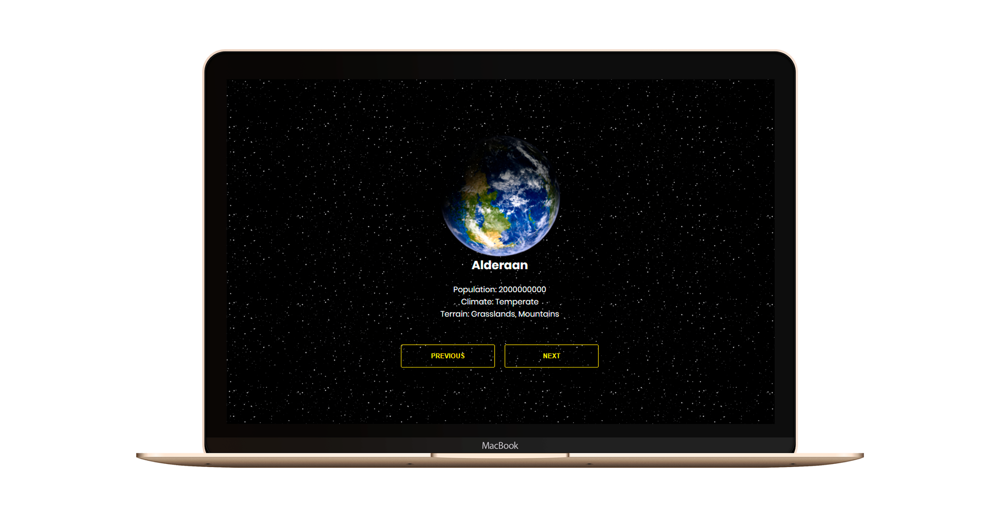

<h1 align="center">
  🚀 SWAPI (Star Wars API)
</h1>

  

  

  

  

  

  <a href="#rocket-tecnologias">Tecnologias</a>&nbsp;&nbsp;&nbsp;|&nbsp;&nbsp;&nbsp;
  <a href="#-projeto">Projeto</a>&nbsp;&nbsp;&nbsp;|&nbsp;&nbsp;&nbsp;
  <a href="#-layout">Layout</a>&nbsp;&nbsp;&nbsp;|&nbsp;&nbsp;&nbsp;

 

  

# Swapi
Desafio Técnico: Dev. Front-End.

## :rocket: Tecnologias:
Esse projeto foi desenvolvido com as seguintes tecnologias:
- [ReactJS](https://reactjs.org)
- [Swapi.co](https://swapi.co/api/)

## 💻 Projeto

O Swapi é um desafio que visa listar em uma aplicação, alguns planetas da SAGA Star Wars (para aqueles fãs irados)
onde essa listagem mostra algumas informações como: população, terras e alguns filmes que determinado planeta participou/apareceu em cena.

## 🔖 Layout
Tentei seguir o máximo de originalidade possível. Peguei algumas imagens de planetas e coloquei um fundo estrelado,
justamente para dar aquele aspecto de estar no espaço. Sem contar com os efeitos e cores dos botões, lembrando a cor da logo do STAR WARS.

Feito com ♥ by Wander Hungerbühler :wave:
